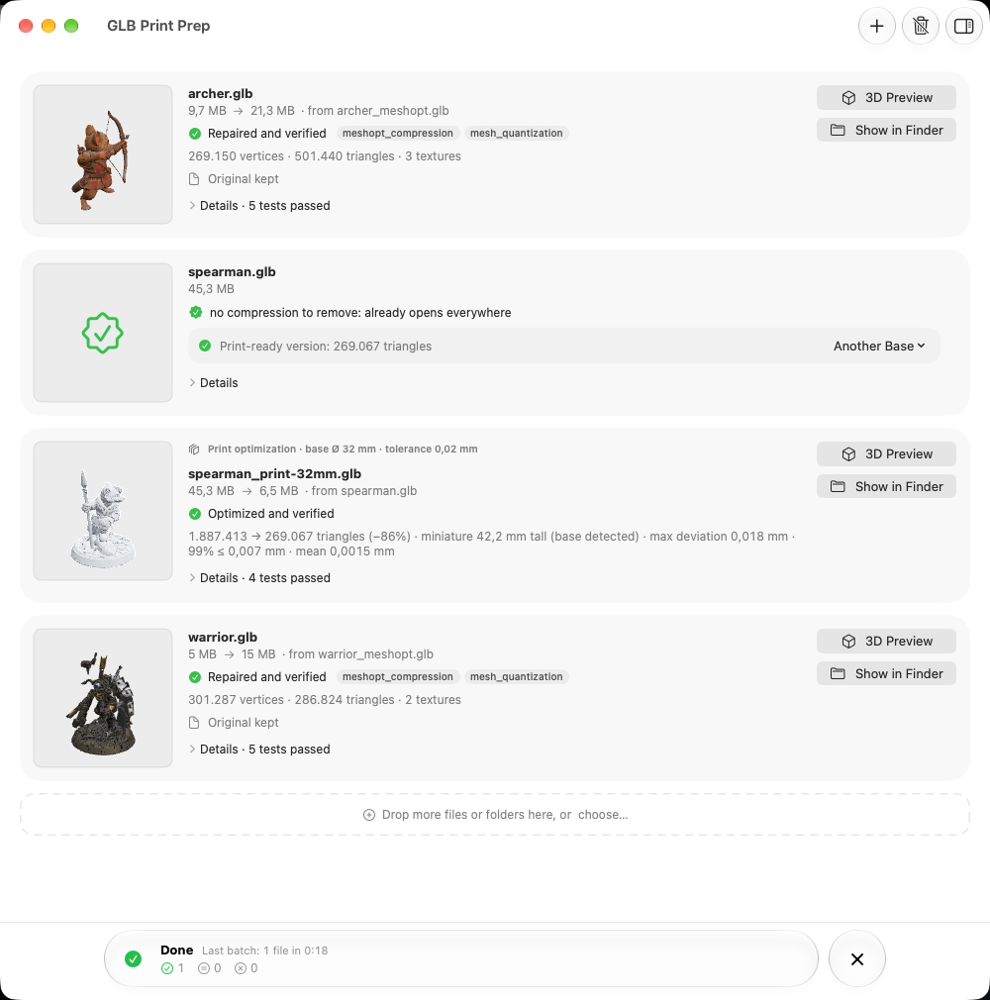
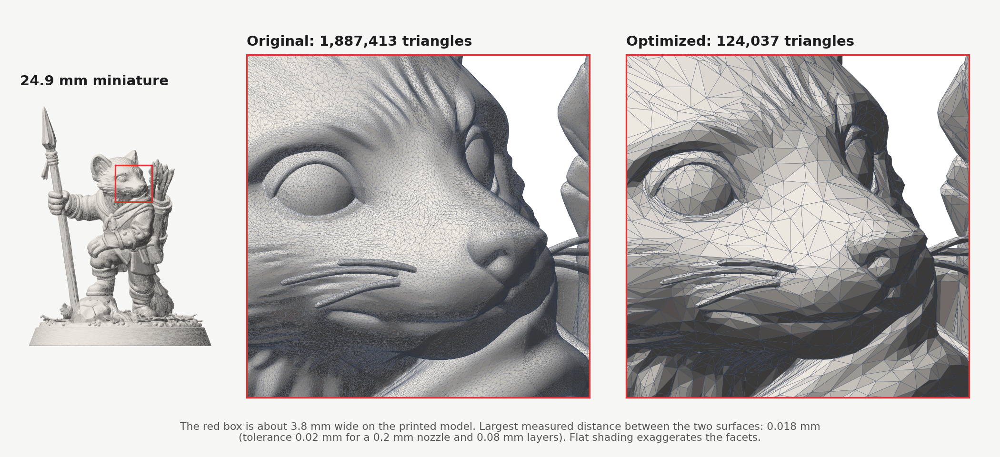
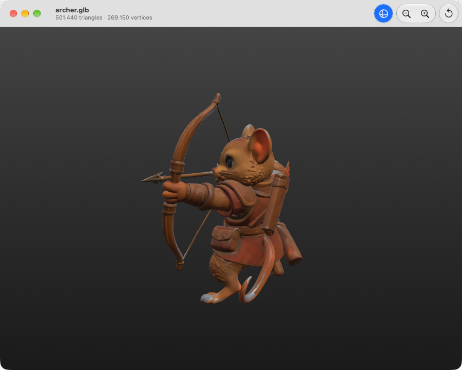

# GLB Print Prep

[](https://github.com/Camponotus-vagus/glb-print-prep/actions/workflows/ci.yml)
[](https://github.com/Camponotus-vagus/glb-print-prep/releases/latest)
[](LICENSE)

GLB Print Prep is a macOS app and a command-line tool for two jobs:

1. **Repair** GLB files that other programs can't open because they are compressed.
2. **Reduce** the triangle count of heavy models before 3D printing, keeping the change to the surface
   smaller than what the printer can reproduce.

I wrote it for miniatures made with AI generators such as Tripo, Meshy or Hunyuan3D, which I print on a
Bambu Lab A1 with a 0.2 mm nozzle. It works with any GLB.

<p align="center">
  <picture>
    <source media="(prefers-color-scheme: dark)" srcset="docs/images/app-dark.png">
    
  </picture>
</p>

## Repair

Many generators export GLBs compressed with `EXT_meshopt_compression`, `KHR_mesh_quantization` or Draco.
Blender, most slicers and many viewers can't read them and show errors such as "Invalid byteLength" or an
empty scene. GLB Print Prep decodes the file and writes a standard GLB next to it.

The original is moved to the Trash only after five checks pass:

1. the new file has a valid GLB structure and no compression extensions left;
2. it opens with a plain glTF reader that has no decoders;
3. the official Khronos glTF Validator reports no errors;
4. its content matches the original: every vertex attribute and index, materials, node transforms and the
   bytes of every texture;
5. the file on disk has the same SHA-256 checksum as the data that was written.

## Optimize for printing

AI models often have one to two million triangles. At miniature scale most of them describe details
smaller than a 0.2 mm nozzle or a 0.08 mm layer can print, and they make slicers slow.

GLB Print Prep works out the real size of the model from its round base (25 or 32 mm, for example), then
looks for the smallest triangle count whose surface stays within a tolerance of the original. The
tolerance comes from the nozzle and layer height: 0.02 mm with the default settings. The distance
between the two surfaces is measured on 150,000 sample points in each direction (Hausdorff distance), and
the result is also checked for new holes or non-manifold edges.

<p align="center">
  
</p>

On this miniature, Bambu Studio's "Extra high" simplification keeps 133,529 triangles and does not
report how far the surface moved. GLB Print Prep keeps 124,037 with a measured maximum difference of
0.018 mm. More numbers in [docs/benchmarks.md](docs/benchmarks.md).

## Other features

- Drop files or whole folders onto the window; several files are processed in parallel.
- Progress for every file, with the current step, elapsed and remaining time, and the CPU and memory
  used by the engine.
- 3D previews of every result, and a full viewer with PBR materials, WebP textures and point clouds.
- An option to keep only the optimized versions and move everything else to the Trash.
- Settings for nozzle, layer height, detail level and default base size.

<p align="center">
  
</p>

## Install

### macOS app

Requires macOS 26 or later on a Mac with Apple Silicon. Node.js is included in the app.

1. Download `GLB-Print-Prep-x.y.z-macOS-arm64.zip` from the
   [latest release](https://github.com/Camponotus-vagus/glb-print-prep/releases/latest).
2. Unzip it and move **GLB Print Prep.app** to Applications.
3. The app is not notarized yet, so macOS blocks the first launch. Right-click the app and choose
   **Open**, or run:
   ```sh
   xattr -dr com.apple.quarantine "/Applications/GLB Print Prep.app"
   ```

### Command line (macOS, Linux, Windows)

Requires Node.js 22 or later.

```sh
git clone https://github.com/Camponotus-vagus/glb-print-prep.git
cd glb-print-prep/engine && npm ci
node bin/glb-print-prep.mjs --help
```

## Command-line usage

```sh
# Repair: model_meshopt.glb becomes model.glb (or model_fixed.glb). Input files are never modified.
glb-print-prep model_meshopt.glb other.glb

# Optimize for a 32 mm base with the default profile (0.2 mm nozzle, 0.08 mm layers, 0.02 mm tolerance)
glb-print-prep --optimize --base 32 model.glb

# Choose the tolerance yourself, or describe another printer
glb-print-prep --optimize --base 25 --tolerance 0.01 model.glb
glb-print-prep --optimize --nozzle 0.4 --layer 0.12 --detail medium model.glb

# Reduce to a fixed number of triangles
glb-print-prep --target 300000 model.glb
```

| Detail level | Tolerance                   | With a 0.2 mm nozzle and 0.08 mm layers |
| ------------ | --------------------------- | --------------------------------------- |
| extra-high   | min(layer / 8, nozzle / 20) | 0.01 mm                                 |
| high         | min(layer / 4, nozzle / 10) | 0.02 mm                                 |
| medium       | min(layer / 2, nozzle / 5)  | 0.04 mm                                 |
| low          | min(layer, nozzle × 2/5)    | 0.08 mm                                 |

`--json` prints one progress event per line; the app uses it to follow the engine. The exit code is `0`
on success, `1` if a file failed and `2` for a usage error.

## How it works

Repair uses [glTF-Transform](https://gltf-transform.dev) with the meshoptimizer and Draco decoders.
Optimization uses meshoptimizer's simplifier, which also takes normals and texture coordinates into
account. Afterwards the engine removes zero-thickness "fins" left by the simplifier, prevents pinched
edges, and adjusts the triangle count until the measured difference sits just under the tolerance.
[docs/how-it-works.md](docs/how-it-works.md) has the details and the format of the progress events.

## Limitations

- The app runs on macOS 26 or later with Apple Silicon. The command-line tool runs wherever Node.js 22
  runs.
- The base is looked for at the bottom of the model, which glTF defines as Y-up. If no round base is found,
  the widest horizontal size of the model is used instead.
- Only triangle meshes are simplified. Point clouds and lines are copied unchanged.
- The app is not notarized by Apple yet (see Install).

## Support

GLB Print Prep is free and open source. If you find it useful, you can support its development on
[GitHub Sponsors](https://github.com/sponsors/Camponotus-vagus) or [Ko-fi](https://ko-fi.com/zermat).
Bug reports and suggestions go in [Issues](https://github.com/Camponotus-vagus/glb-print-prep/issues);
[CONTRIBUTING.md](CONTRIBUTING.md) explains how to build and test the project.

## License

[MIT](LICENSE), © 2026 Francesco Simone Mensa.

The engine is built on [glTF-Transform](https://github.com/donmccurdy/glTF-Transform),
[meshoptimizer](https://github.com/zeux/meshoptimizer), [Draco](https://github.com/google/draco) and the
[Khronos glTF Validator](https://github.com/KhronosGroup/glTF-Validator). The macOS app includes
[Node.js](https://nodejs.org) (MIT license).

## Star history

<a href="https://www.star-history.com/#Camponotus-vagus/glb-print-prep&Date">
  <picture>
    <source media="(prefers-color-scheme: dark)" srcset="https://api.star-history.com/svg?repos=Camponotus-vagus/glb-print-prep&type=Date&theme=dark">
    
  </picture>
</a>
